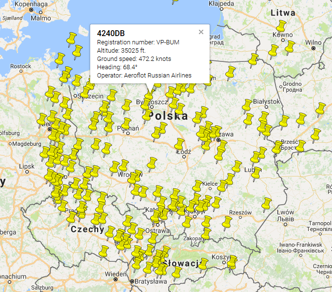

# FlightRadar
A simple tool to check what flies over your head.
Using ADS-B data from [https://www.adsbexchange.com](https://www.adsbexchange.com)
---
The script generates a KML file containing the marked airplanes in the selected area.

You can preview Your map [here](http://kmlviewer.nsspot.net/)